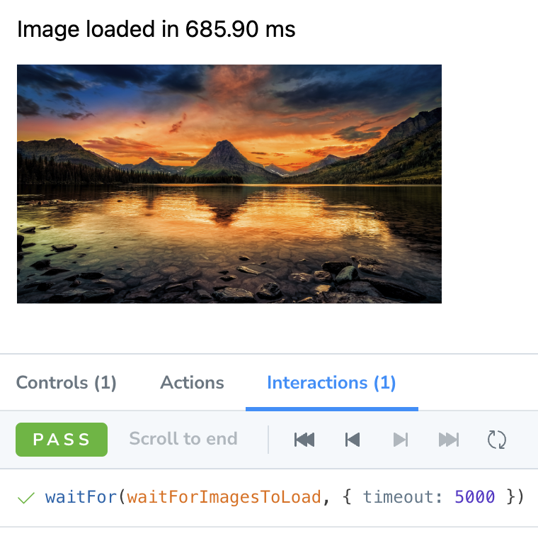

Hey there!

This is an example of how to set up different ways to deal with image handling in Storybook, to make sure you are able to take proper snapshot of your components only after the images have been loaded, therefore reducing inconsistency in your snapshots.


### The issue

Whenever you render components in Storybook that fetch images which are not hosted locally, you have the risk of layout shifts, which happen dependening on how long the image takes to load.

When using a visual regression testing solution like [Chromatic](https://www.chromatic.com/), you have the risk of getting inconsistent snapshots, especially when the images are big in quality and size.

### The solution

There are countless ways to fix this. If you are able to make changes in your code, follow instructions such as suggested [here](https://www.chromatic.com/docs/resource-loading) and [here](https://www.chromatic.com/docs/snapshots#where-are-my-images-and-fonts).

If you are not able to make changes, here are a couple different solutions to circumvent image loading issues:

#### Play function

This method uses the play function to wait for all images to load, and the interaction panel will show an error if it takes too long to load them.

Given a utility function that waits for all images to be loaded:

```ts
// util.ts
export async function waitForImagesToLoad() {
  const images = Array.from(document.getElementsByTagName('img'))

  await Promise.all(
    images.map((image) => {
      if (image.complete) {
        return Promise.resolve()
      } else {
        return new Promise((resolve) => {
          image.addEventListener('load', resolve)
        })
      }
    })
  )
}
```

Use it in your play function, and add it in a `waitFor` if you'd like to see that in the interactions panel, and also get an error thrown when the images take too long to load.

```ts
// MyComponent.stories.ts
import { waitFor } from '@storybook/testing-library'
import { waitForImagesToLoad } from './util'

export const WaitForImagesInPlayFunction = {
  play: async () => {
    // you can configure the timeout, but be aware that if this takes long, things are bad!
    await waitFor(waitForImagesToLoad, { timeout: 5000 })
  },
}
```

**Result**:



> Note:
> Be aware that if the images take too long to load, you're better off with the MSW approach.

You can check the code [here](./src/stories/Image.stories.tsx)

#### Mocking the image request and returning locally hosted image instead

This method uses a combination of using a local image + a MSW handler using <a href="https://github.com/mswjs/msw-storybook-addon" target='_blank'>msw-storybook-addon</a> to proxy the image request and return a mocked image instead, making it really fast to load the image. In this example, instead of loading a 8k quality image, it just loads a small image instead, effectively 30 times faster than with the previous solution.

Make sure to follow the [addon instructions](https://github.com/mswjs/msw-storybook-addon) and set it up correctly. Also make sure to use a MSW loader so that it registers before the story renders. If you are using the `mswDecorator` it is likely that the behavior will be inconsistent.
 
```ts
// MyComponent.stories.ts
import mockImage from './image.png'
import { rest } from 'msw'

export const MockImagesWithMSW = {
  parameters: {
    msw: {
      handlers: [
        rest.get(
          // define the URL which you want to capture
          'https://wallpaperaccess.com/full/*.jpg',
          // use a locally hosted image instead
          async (_, res, ctx) => {
            const image = await fetch(mockImage).then((res) =>
              res.arrayBuffer()
            )
            return res(
              ctx.set('Content-Length', image.byteLength.toString()),
              ctx.set('Content-Type', 'image/png'),
              ctx.body(image)
            )
          }
        ),
      ],
    },
  },
}
```

**Result**:


You can check the code [here](./src/stories/Image.stories.tsx)